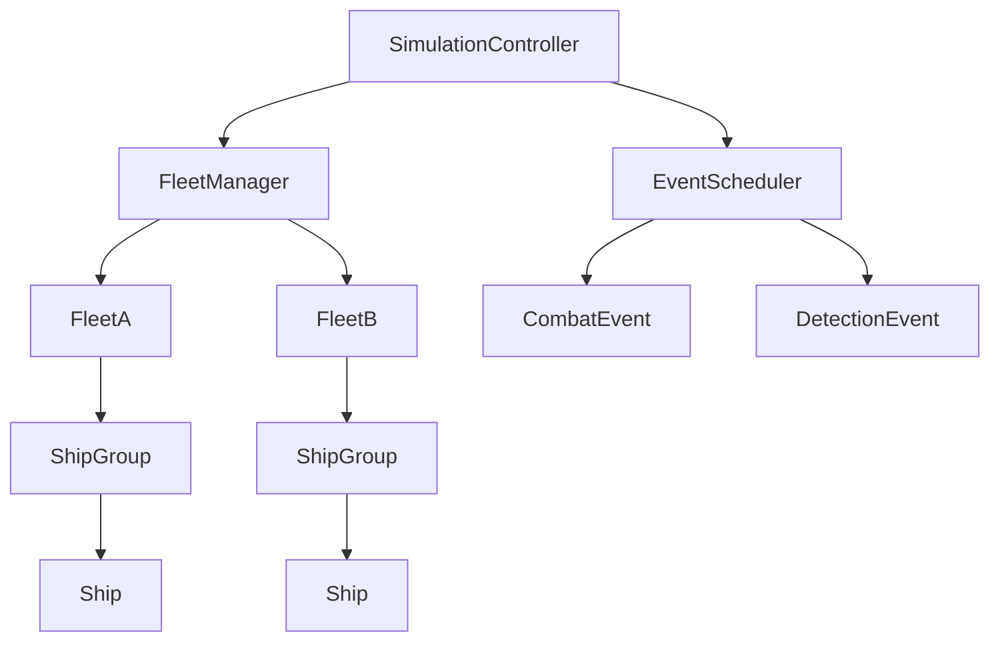
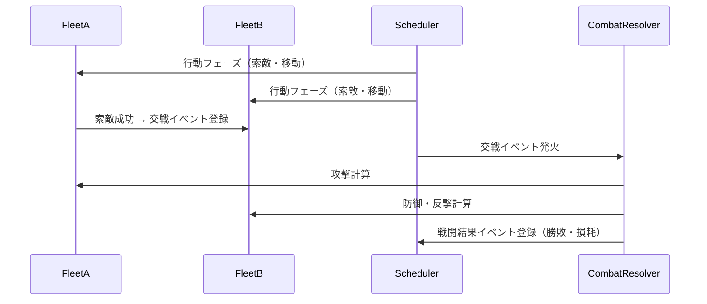
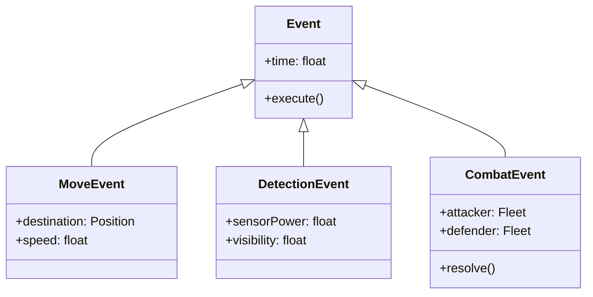

## 🎯 シミュレーション目的と要件整理

| 項目         | 内容                                                                    |
| ------------ | ----------------------------------------------------------------------- |
| **目的**     | 2つの艦隊の行動（移動・索敵・交戦）をシミュレートし、交戦結果を算出する |
| **粒度**     | 「艦隊」単位を中心にしつつ、戦闘時は「艦船」単位のパラメータを参照する  |
| **処理形態** | 時間ステップ型（1ターン単位で行動と判定を進行）                         |
| **並列性**   | 艦船・艦隊単位で並列化可能（後述）                                      |
| **再現性**   | 疑似乱数のシードを固定可能にすることで再現性を確保                      |
| **拡張性**   | 将来的に輸送・人口など他レイヤーと統合できる設計を志向                  |

---

## 🧩 ソリューション選定（実装言語・アーキテクチャ視点）

| 観点                     | 推奨方針                                                        | 理由                                                                                   |
| ------------------------ | --------------------------------------------------------------- | -------------------------------------------------------------------------------------- |
| **シミュレーション方式** | 離散イベントシミュレーション（Discrete Event Simulation）       | 艦隊行動は「イベント（索敵・移動・攻撃）」単位で発生するため、イベント駆動モデルが自然 |
| **データ構造**           | ECS（Entity Component System）またはOOP（オブジェクト指向）構造 | - ECS: 大規模化・並列化を意識した構成 - OOP: 初期実装の理解しやすさ                 |
| **計算基盤**             | CPUマルチスレッド＋軽量並列ジョブ（スレッドプール）             | 艦船単位の演算を並列化可能。GPUは過剰。                                                |
| **状態管理**             | 状態遷移モデル（State Machine）                                 | 艦隊のフェーズ（索敵中→交戦中→離脱）を表現しやすい                                     |
| **データ永続化**         | 必要に応じてスナップショット方式（セーブ／ロード）              | 長期戦闘や検証用に適する                                                               |
| **可視化・検証**         | コンソール／簡易ログベース                                      | 初期段階では結果解析重視で十分                                                         |

---

## ⚙️ システム構造設計

### 上位構造

| コンポーネント                         | 役割                                           |
| -------------------------------------- | ---------------------------------------------- |
| **SimulationController**               | 全体の時間進行・イベントスケジューリングの統括 |
| **FleetManager**                       | 艦隊の登録・位置・行動管理                     |
| **Fleet**                              | 複数の艦船を束ねた部隊単位                     |
| **ShipGroup / Ship**                   | 実際の戦闘単位。攻撃・防御・燃料・士気を持つ   |
| **EventScheduler**                     | イベントを時系列で管理・実行                   |
| **Event（Combat / Detection / Move）** | 各行動・戦闘を表す                             |

---

## ⚔️ 戦闘シーケンス

---

## 🔍 戦闘パラメータモデル（艦船単位）

| カテゴリ | パラメータ               | 説明                       |
| -------- | ------------------------ | -------------------------- |
| 基本     | 種別（戦艦・巡洋艦など） | 戦闘力・燃費のベースとなる |
| 耐久     | HP（耐久力）             | 0で撃沈                    |
| 攻撃     | 攻撃力、射程、命中率     | 攻撃フェーズに使用         |
| 防御     | 装甲、回避率             | 被弾時のダメージ軽減       |
| 行動     | 速度、燃料残量           | 行動範囲と行動コスト       |
| 乗員     | 練度、士気               | 命中率・被弾時反応に影響   |
| 状態     | 損傷度、弾薬残量         | 継戦能力を制限             |

---

## 🧮 イベント制御（抽象クラス構造）

---

## 🚀 並列化とスケーリング

| 粒度         | 並列対象                   | 並列実行方式                 |
| ------------ | -------------------------- | ---------------------------- |
| 艦船単位     | 攻撃・防御・移動計算       | スレッドプールまたはTask並列 |
| 艦隊単位     | 索敵・行動フェーズ         | 各艦隊を独立ジョブとして処理 |
| イベント単位 | CombatEvent, MoveEventなど | イベントキューを分割処理可能 |

> 2艦隊程度であれば単スレッド実行で十分。
> 将来的に数十艦隊・数百艦船になる場合はECS構造＋バッチ更新へ移行。

---

## 📈 拡張可能な領域（将来構想）

| 拡張方向                           | 説明                                     |
| ---------------------------------- | ---------------------------------------- |
| **戦略AI**                         | 艦隊行動（回避・包囲）をAI制御化         |
| **補給線シミュレーション**         | 燃料・弾薬を戦略レイヤーに接続           |
| **人口・輸送シミュレーション統合** | 艦隊行動を経済・人口変動に反映           |
| **可視化**                         | WebまたはGUIベースの戦況表示（2Dマップ） |

---

## 🧭 推奨初期実装範囲（段階的開発）

| フェーズ    | 実装対象                    | 目的                       |
| ----------- | --------------------------- | -------------------------- |
| **Phase 1** | 2艦隊・索敵～交戦～結果出力 | 戦闘ロジック検証           |
| **Phase 2** | 艦船単位の耐久・燃料管理    | 継戦判定の導入             |
| **Phase 3** | 士気・練度・環境要素        | シミュレーションの厚み向上 |
| **Phase 4** | 並列実行・ログ分析          | 高速化とチューニング       |
