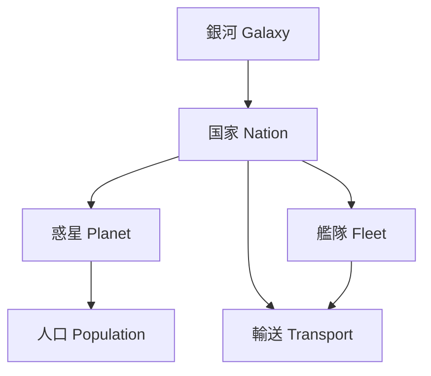
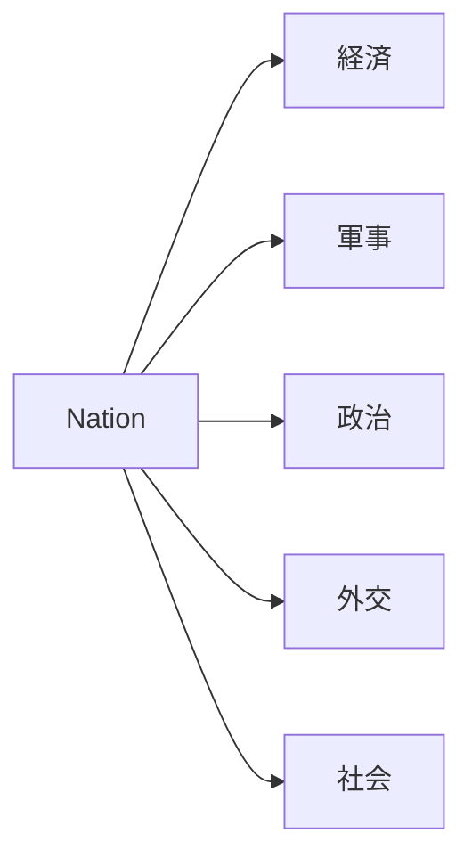
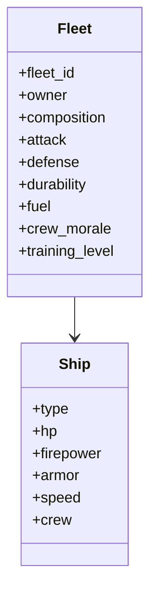
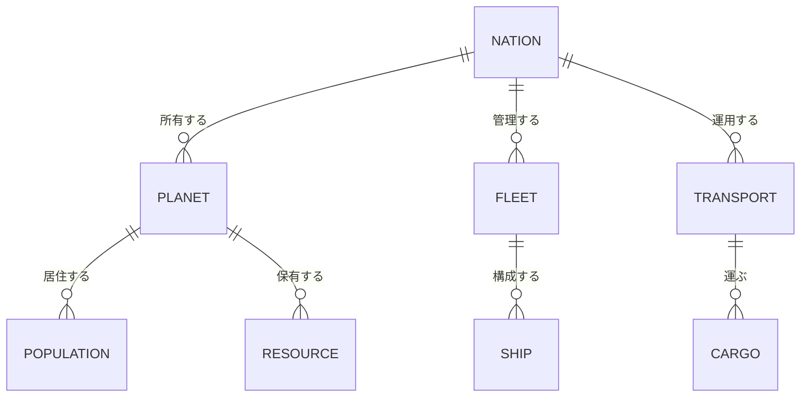
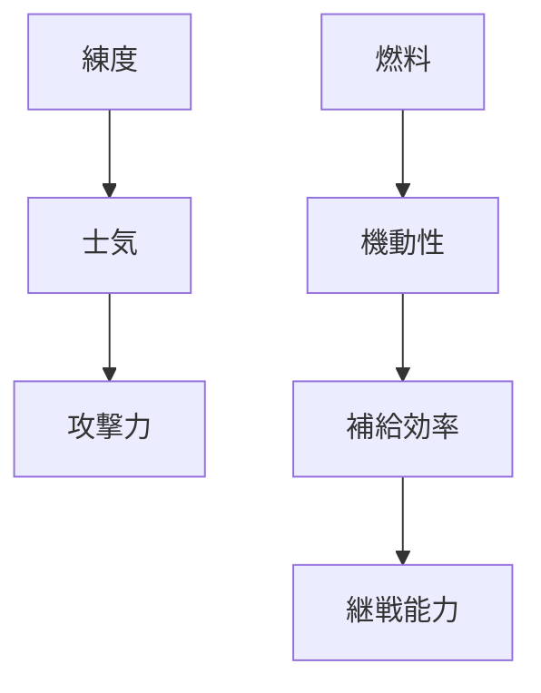

了解しました。
以下は、「銀河シミュレーション設計資料：パラメータ設計編」です。
ここではコードや特定言語の構文は使用せず、**要素・パラメータ・関係性**に焦点を当てて設計しています。
システム構造の把握を助けるため、要所に **Mermaid図** を挿入しています。

---

# 🌌 銀河シミュレーション設計資料（パラメータ設計編）

## 1. 概要

本シミュレーションは、架空の銀河を舞台に以下の要素を中心にモデル化する。

* 銀河（恒星系ネットワーク）
* 国家（政治・経済・軍事単位）
* 艦隊（移動・戦闘単位）
* 輸送（資源・人員移動単位）
* 惑星（生産・人口の拠点）
* 人口（経済・社会の基礎）

各要素は相互に依存し、更新周期やスケールが異なる。

---

## 2. 全体構造

**階層構造の特徴:**

* 銀河は恒星系間の「ネットワークトポロジー」を定義する。
* 国家は複数の惑星・艦隊・輸送線を管理する。
* 惑星は人口と生産の拠点。
* 艦隊と輸送は動的要素で、国家の資源フローを実現する。

---

## 3. 要素別パラメータ設計

### 3.1 銀河（Galaxy）

| カテゴリ   | パラメータ                                 | 説明               |
| :----- | :------------------------------------ | :--------------- |
| 位置     | `x, y, z`                             | 銀河座標             |
| ネットワーク | `connections`                         | 接続星系リスト          |
| 環境     | `density`, `radiation`, `instability` | 資源密度、放射線量、重力不安定性 |
| 歴史     | `age`, `supernova_events`             | 銀河年齢、過去の爆発履歴     |

---

### 3.2 国家（Nation）

| カテゴリ | パラメータ                                                     | 説明                  |
| :--- | :-------------------------------------------------------- | :------------------ |
| 政治   | `government_type`, `stability`, `legitimacy`              | 政体、国内安定度、正統性        |
| 経済   | `gdp`, `industrial_index`, `tech_level`, `resource_stock` | 経済規模、産業指数、技術水準、資源在庫 |
| 軍事   | `fleet_count`, `mobilization`, `doctrine`                 | 艦隊数、動員率、軍事ドクトリン     |
| 外交   | `relations`, `alliances`, `treaties`                      | 他国家との関係値・同盟・条約      |
| 社会   | `population_total`, `happiness`, `inequality`             | 総人口、幸福度、格差指数        |
| 政策   | `focus`, `tax_rate`, `research_budget`                    | 政策方針、税率、研究予算配分      |

**関係図:**

---

### 3.3 惑星（Planet）

| カテゴリ | パラメータ                                                        | 説明                 |
| :--- | :----------------------------------------------------------- | :----------------- |
| 環境   | `gravity`, `temperature`, `biome`, `habitability`            | 重力、平均温度、バイオーム、居住適性 |
| 資源   | `minerals`, `energy`, `food`, `rare_elements`                | 各種資源埋蔵量            |
| 社会   | `population`, `infrastructure`, `stability`                  | 人口、インフラ整備度、治安      |
| 生産   | `industrial_output`, `agriculture_output`, `research_output` | 各産業の生産力            |
| 軍事   | `garrison_strength`, `defense_system`                        | 駐留戦力、防衛システム        |
| 所属   | `owner`, `star_system`                                       | 所有国家、所属恒星系         |

---

### 3.4 艦隊（Fleet）

| カテゴリ | パラメータ                                         | 説明               |
| :--- | :-------------------------------------------- | :--------------- |
| 識別   | `fleet_id`, `name`, `owner`                   | 艦隊ID、名称、所属国家     |
| 編成   | `composition`                                 | 戦艦・巡洋艦・駆逐艦などの構成比 |
| 能力   | `attack`, `defense`, `durability`, `mobility` | 攻撃力、防御力、耐久、機動性   |
| 状態   | `fuel`, `crew_morale`, `training_level`       | 燃料、士気、練度         |
| 任務   | `mission_type`, `target`, `status`            | 現在の任務、目的地、状態     |
| 位置   | `current_system`, `coordinates`               | 現在の星系・座標         |
| 物流   | `supply_needs`, `cargo`                       | 補給要求量、積載物資       |

**艦隊構成イメージ:**

---

### 3.5 輸送（Transport）

| カテゴリ | パラメータ                                            | 説明                |
| :--- | :----------------------------------------------- | :---------------- |
| 識別   | `transport_id`, `owner`, `origin`, `destination` | 輸送ID、所属国家、出発地、目的地 |
| 積載   | `cargo_type`, `cargo_amount`                     | 積載物種別（資源・人員など）、数量 |
| 経路   | `path`, `eta`, `status`                          | 航路、到着予定、現在の状態     |
| 輸送手段 | `vessel_type`, `capacity`, `speed`               | 船種、積載能力、移動速度      |
| リスク  | `piracy_risk`, `navigation_hazard`               | 海賊・航行リスク指数        |

**輸送はイベントドリブンな存在：**

* 出発・到着イベント
* 敵艦隊との遭遇イベント
* 船団損失・資源補給イベント

---

### 3.6 人口（Population）

| カテゴリ | パラメータ                                        | 説明             |
| :--- | :------------------------------------------- | :------------- |
| 構成   | `total`, `workers`, `scientists`, `soldiers` | 職業区分           |
| 生活   | `happiness`, `health`, `education`           | 幸福度、健康、教育水準    |
| 成長   | `birth_rate`, `death_rate`, `migration_rate` | 各種変動率          |
| 経済   | `income`, `consumption`, `unemployment`      | 収入、消費、失業率      |
| 社会   | `ideology`, `unrest`, `loyalty`              | イデオロギー、暴動度、忠誠度 |

---

## 4. 要素間の主要関係

---

## 5. パラメータ依存関係（例）

**例:**

* 練度が高いと士気上昇、士気が高いと戦闘効率向上
* 燃料不足は機動力を低下させ、継戦能力にも悪影響

---

## 6. 更新サイクル例

| 階層 | 更新間隔    | 主な更新内容     |
| :- | :------ | :--------- |
| 銀河 | 年単位     | 星系の変動・航路更新 |
| 国家 | 週単位     | 政策決定・経済・外交 |
| 惑星 | 月単位     | 生産・人口変化    |
| 艦隊 | 日単位     | 移動・戦闘・補給   |
| 輸送 | イベント発生時 | 出発・到着・事故処理 |
| 人口 | 月単位     | 成長・移民・不満変動 |

---

## 7. スケーラビリティ指針

| 要素 | 並列化単位      | 最適化方針       |
| :- | :--------- | :---------- |
| 国家 | Actor単位    | 独立AIによる意思決定 |
| 艦隊 | ECS/ベクトル処理 | 物理演算の一括更新   |
| 輸送 | イベント駆動     | 到着時のみ計算     |
| 人口 | 統計近似       | 都市単位で集約     |

---

## 8. 今後の展開（次フェーズ提案）

* **パラメータの動的モデル化**

  * 練度上昇や士気低下などの時間依存関数定義
* **イベント設計**

  * 輸送襲撃、外交危機、惑星反乱などの発生モデル
* **国家AI行動ロジック**

  * 外交・内政・軍事方針決定アルゴリズム
* **シミュレーション評価メトリクス**

  * GDP推移、領土変動、技術進化、戦争頻度などの出力指標

