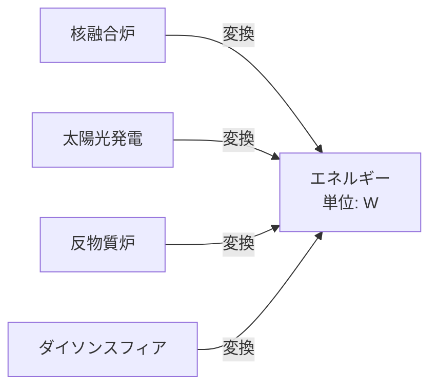
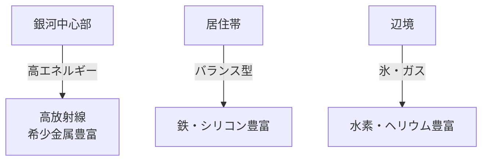

# 資源システム設計

## 概要

本シミュレーションでは、資源を**元素レベル**で管理し、惑星ごとの産出量・技術レベルによる採掘効率・国家間の資源分布の偏りをモデル化します。

---

## 資源の基本方針

### 設計原則

| 項目           | 方針                                     |
| -------------- | ---------------------------------------- |
| 資源枯渇       | **基本的に枯渇しない**（無限資源モデル） |
| 惑星産出量     | 固定値（惑星ごとに異なる）               |
| 採掘効率       | 技術レベルで変動（Lv1: 50% → Lv10: 100%）|
| 資源分布の偏り | 銀河レベルで地域的偏在を設定             |
| 人口           | 人数で表記、年齢による職能は考慮しない   |
| 寿命           | 医療・技術レベルで変動                   |

---

## エネルギー資源

### エネルギー単位: W（ワット）

すべてのエネルギーを**ワット（W）表記**で統一。エネルギー源の種類に関わらず、一律変換可能とします。



### エネルギー源と出力

| エネルギー源       | 単位出力         | 技術要求Lv | 建造コスト | 備考                 |
| ------------------ | ---------------- | ---------- | ---------- | -------------------- |
| 核分裂炉           | 10^9 W           | 1.0        | 低         | 初期技術             |
| 核融合炉           | 10^12 W          | 2.0        | 中         | 標準的発電           |
| 太陽光パネル       | 10^6 W / km²     | 1.5        | 低         | 惑星・軌道ステーション |
| 地熱発電           | 10^8 W           | 1.0        | 低         | 火山惑星で効率的     |
| 反物質炉           | 10^15 W          | 6.0        | 極高       | 超高出力             |
| ダイソンスフィア   | 10^26 W          | 8.0        | 国家級PJ   | 恒星エネルギー全捕獲 |

### エネルギー消費

```python
class EnergyConsumption:
    def __init__(self, planet):
        self.industrial = planet.heavy_industry_output * 1e6  # 重工業は高消費
        self.residential = planet.population * 5000  # 1人あたり5kW
        self.military = planet.garrison_fleet * 1e9  # 艦船1隻=1GW
        self.infrastructure = planet.infrastructure_level * 1e8

    def total_demand(self):
        return self.industrial + self.residential + self.military + self.infrastructure
```

**エネルギー不足のペナルティ**:
```python
energy_ratio = energy_supply / energy_demand

if energy_ratio < 0.8:
    production_penalty = energy_ratio  # 生産量が供給率に比例して減少
    happiness_penalty = -10 * (1 - energy_ratio)  # 国民不満
```

---

## 鉱物資源（元素周期表ベース）

### 主要元素リスト

#### 1. 構造材（Common Metals）

| 元素 | 名称       | 主要用途                     | 銀河平均産出量 | 希少度 |
| ---- | ---------- | ---------------------------- | -------------- | ------ |
| Fe   | 鉄         | 基礎構造材、艦船装甲         | 高             | 普通   |
| Al   | アルミニウム | 軽量構造材                   | 高             | 普通   |
| Ti   | チタン     | 高強度軽量装甲               | 中             | 中     |
| Ni   | ニッケル   | 合金、耐熱材                 | 中             | 普通   |
| Cu   | 銅         | 配線、熱伝導材               | 中             | 普通   |

#### 2. 希少金属（Rare Metals）

| 元素 | 名称       | 主要用途                     | 銀河平均産出量 | 希少度 |
| ---- | ---------- | ---------------------------- | -------------- | ------ |
| Au   | 金         | 電子部品、接点               | 低             | 希少   |
| Ag   | 銀         | 電気伝導、触媒               | 低             | 中     |
| Pt   | 白金       | 触媒、高温部品               | 極低           | 希少   |
| Pd   | パラジウム | 触媒、電子部品               | 極低           | 希少   |
| Ir   | イリジウム | 超高温耐性材料               | 極低           | 極希少 |

#### 3. エネルギー関連元素

| 元素 | 名称           | 主要用途                     | 銀河平均産出量 | 希少度 |
| ---- | -------------- | ---------------------------- | -------------- | ------ |
| U    | ウラン         | 核分裂炉燃料                 | 中             | 中     |
| Pu   | プルトニウム   | 高出力核分裂炉               | 極低           | 希少   |
| H    | 水素           | 核融合燃料（重水素・三重水素） | 極高           | 豊富   |
| He   | ヘリウム       | 核融合副産物、冷却材         | 高             | 普通   |
| Li   | リチウム       | バッテリー、核融合ブランケット | 中             | 中     |

#### 4. 半導体・電子材料

| 元素 | 名称       | 主要用途                     | 銀河平均産出量 | 希少度 |
| ---- | ---------- | ---------------------------- | -------------- | ------ |
| Si   | シリコン   | 半導体、太陽電池             | 極高           | 豊富   |
| Ge   | ゲルマニウム | 高性能半導体                 | 低             | 中     |
| Ga   | ガリウム   | 化合物半導体（GaAs）         | 低             | 中     |
| In   | インジウム | 透明電極、ディスプレイ       | 低             | 希少   |

#### 5. その他戦略資源

| 元素 | 名称       | 主要用途                     | 銀河平均産出量 | 希少度 |
| ---- | ---------- | ---------------------------- | -------------- | ------ |
| C    | 炭素       | ナノマテリアル、ダイヤモンド | 高             | 普通   |
| W    | タングステン | 超高温部品、弾頭             | 中             | 中     |
| Co   | コバルト   | 高温合金、磁石               | 中             | 中     |
| Nb   | ニオブ     | 超伝導材料                   | 低             | 希少   |

### 惑星ごとの資源分布

```python
class PlanetResourceDeposit:
    """
    惑星の資源埋蔵量（固定値）
    """
    planet_id: str
    resources: Dict[str, float]  # 元素記号 -> 産出量（kg/日）

    # 例:
    # {
    #   'Fe': 1e6,    # 鉄: 1000トン/日
    #   'Ti': 5e4,    # チタン: 50トン/日
    #   'Au': 10,     # 金: 10kg/日
    #   'U': 500      # ウラン: 500kg/日
    # }
```

### 技術レベルによる採掘効率

```python
def calculate_extraction_rate(planet, element):
    """
    実際の採掘量 = 理論産出量 × 採掘効率
    """
    base_output = planet.resource_deposit[element]
    tech_level = planet.nation.tech_level

    # 技術レベルによる効率
    if tech_level < 2.0:
        efficiency = 0.5  # 50%しか採掘できない
    elif tech_level < 5.0:
        efficiency = 0.5 + (tech_level - 2.0) * 0.1  # 50%→80%
    else:
        efficiency = 0.8 + (tech_level - 5.0) * 0.04  # 80%→100%
        efficiency = min(efficiency, 1.0)  # 上限100%

    actual_output = base_output * efficiency
    return actual_output
```

---

## 分子化合物

### 主要化合物

| 化合物 | 化学式 | 主要用途                     | 産出源           |
| ------ | ------ | ---------------------------- | ---------------- |
| 水     | H₂O    | 生命維持、水素製造           | 氷惑星、彗星     |
| メタン | CH₄    | 燃料、化学原料               | ガス惑星         |
| アンモニア | NH₃  | 肥料、化学原料               | 氷惑星           |
| 二酸化炭素 | CO₂  | テラフォーミング、炭素源     | 大気             |
| シリカ | SiO₂   | ガラス、建材                 | 岩石惑星         |

---

## 人口システム

### 人口パラメータ

```python
class Population:
    """
    惑星の人口モデル
    """
    total: int  # 総人口（人）
    birth_rate: float  # 出生率（年率）
    death_rate: float  # 死亡率（年率）
    life_expectancy: int  # 平均寿命（年）

    # 職業分布（比率）
    workers_ratio: float       # 労働者
    scientists_ratio: float    # 科学者
    soldiers_ratio: float      # 軍人
    unemployed_ratio: float    # 失業者
```

### 人口増減モデル

```python
def update_population(planet, delta_years=1):
    """
    人口の自然増減
    """
    births = planet.population * planet.birth_rate * delta_years
    deaths = planet.population * planet.death_rate * delta_years

    # 移民（経済状況・幸福度で変動）
    immigration = calculate_immigration(planet)

    planet.population += births - deaths + immigration
    return planet.population
```

### 寿命の決定要因

```python
def calculate_life_expectancy(nation):
    """
    平均寿命 = 基礎寿命 × 医療レベル係数 × 技術レベル係数
    """
    base_life = 80  # 基礎寿命（年）
    medical_multiplier = 1.0 + nation.medical_level * 0.1  # 医療Lv10で2.0倍
    tech_multiplier = 1.0 + (nation.tech_level - 1.0) * 0.05  # 技術Lv10で1.45倍

    life_expectancy = base_life * medical_multiplier * tech_multiplier
    return int(life_expectancy)
```

| 技術Lv | 医療Lv | 平均寿命 |
| ------ | ------ | -------- |
| 1.0    | 1.0    | 80年     |
| 3.0    | 5.0    | 120年    |
| 5.0    | 8.0    | 150年    |
| 10.0   | 10.0   | 232年    |

### 年齢構造の簡略化

**Phase 1では年齢による職能を考慮しない**:
- 0歳から労働可能（簡略化）
- 寿命到達で死亡
- 労働生産性は一律（高齢者ペナルティなし）

**Phase 3以降の拡張案**:
- 年齢層別（0-18歳、18-65歳、65歳以上）の労働生産性
- 教育期間・退職制度の導入

---

## 資源分布の偏り（銀河レベル）

### 地域別資源特性



### 資源分布テーブル（例）

| 領域       | Fe  | Ti  | Au  | U   | H   | He  | H₂O |
| ---------- | --- | --- | --- | --- | --- | --- | --- |
| 銀河中心部 | 中  | 高  | 高  | 高  | 中  | 高  | 低  |
| 居住帯     | 高  | 中  | 中  | 中  | 中  | 中  | 中  |
| 辺境       | 低  | 低  | 低  | 低  | 高  | 高  | 高  |

**戦略的意味**:
- 鉄・チタンが必要な工業国は居住帯に集中
- 希少金属を狙う国家は危険な銀河中心部へ進出
- 核融合燃料（水素）確保のため辺境開拓

---

## 資源の備蓄と枯渇回避

### 備蓄システム

```python
class NationalReserve:
    """
    国家の戦略資源備蓄
    """
    reserves: Dict[str, float]  # 元素記号 -> 備蓄量（kg）

    def consume(self, element, amount):
        if self.reserves[element] >= amount:
            self.reserves[element] -= amount
            return True
        else:
            # 備蓄不足 → 生産ペナルティ
            return False
```

### 枯渇しない理由（設定上の説明）

1. **小惑星帯採掘**: 星系内に無数の小惑星が存在
2. **リサイクル技術**: ナノテクノロジーによる完全リサイクル
3. **深層採掘**: 惑星マントル層まで採掘可能
4. **ガス惑星採掘**: 大気から水素・ヘリウムを無限回収

→ シミュレーション上は「産出量固定・枯渇なし」で簡略化

---

## まとめ

資源システムの特徴：

1. **エネルギーはW表記で統一**: あらゆるエネルギー源を共通単位で管理
2. **元素周期表ベースの鉱物**: 20種類程度の主要元素を管理
3. **技術レベルで採掘効率変動**: 低技術国は50%しか採掘できない
4. **銀河レベルの資源偏在**: 地域ごとに資源分布が異なる
5. **人口は簡略化**: 年齢構造なし、寿命は技術・医療で変動
6. **枯渇なしモデル**: 惑星産出量は固定、戦略性は分布の偏りで表現

Phase 1では基礎的な資源生産・消費を実装し、Phase 2以降で技術効率・備蓄システムを統合します。
