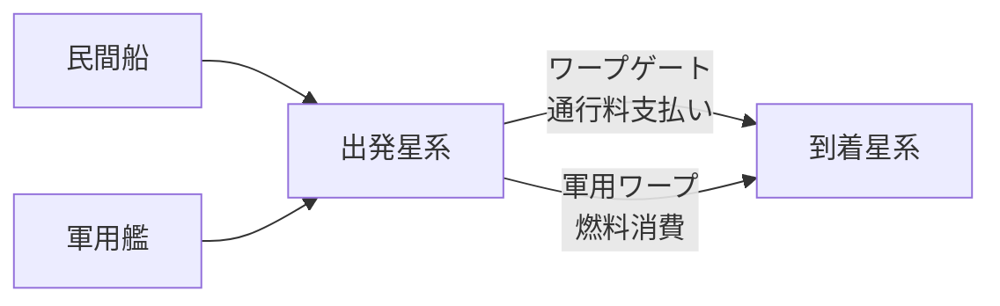
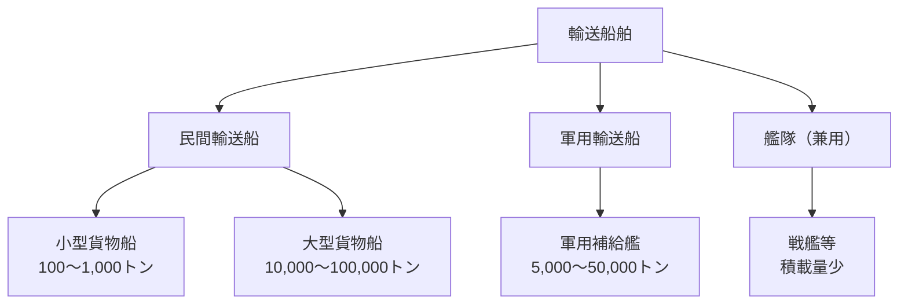
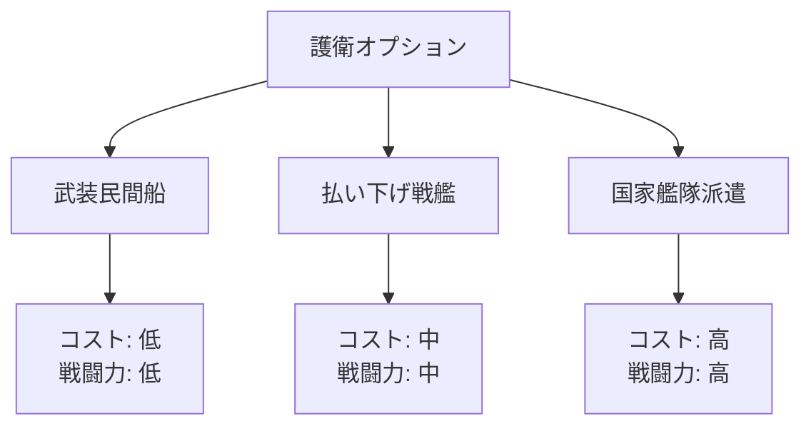

# 輸送システム設計

## 概要

本シミュレーションの輸送システムは、**星系間資源輸送**、**ワープゲート通行料**、**海賊リスク**、**護衛艦隊**を統合的にモデル化します。

---

## 航行速度と移動時間

### 基本方針

**星系間移動は瞬間移動（0秒）** ですが、移動には以下のコストが発生します：

| 移動方式           | 移動時間 | コスト種別       | コスト計算式                       |
| ------------------ | -------- | ---------------- | ---------------------------------- |
| ワープゲート利用   | 0秒      | 通行料（Cr）     | 距離 × 積載量 × 料金係数           |
| ワープ装置（軍用） | 0秒      | 燃料消費（kg）   | 距離 × 艦船質量 × 燃料消費係数     |



### ワープゲート通行料モデル

```python
def calculate_gate_toll(origin, destination, cargo_mass_tons):
    """
    ワープゲート通行料の計算
    """
    distance_ly = calculate_distance(origin, destination)  # 光年
    base_rate = 100  # 基礎料金（Cr/光年/トン）

    # ゲート管理国の料金設定（政策で変動）
    gate_owner = origin.gate_owner
    rate_multiplier = gate_owner.gate_toll_policy  # 0.5～3.0

    toll = base_rate * distance_ly * cargo_mass_tons * rate_multiplier
    return toll
```

**料金係数の例**:
| 国家政策         | 料金係数 | 説明                         |
| ---------------- | -------- | ---------------------------- |
| 自由貿易促進     | 0.5      | 貿易活性化のため低料金       |
| 標準             | 1.0      | 通常料金                     |
| 保護主義         | 1.5      | 自国産業保護のため高関税     |
| 経済制裁中       | 3.0      | 敵対国に対する懲罰的高額料金 |

### 軍用ワープ装置の燃料消費

```python
def calculate_warp_fuel(ship, origin, destination):
    """
    軍用ワープ装置の燃料消費量
    """
    distance_ly = calculate_distance(origin, destination)
    ship_mass_tons = ship.mass
    base_consumption = 10  # kg/光年/トン

    # 技術レベルで燃費改善
    tech_efficiency = 1.0 - (ship.nation.tech_level - 1.0) * 0.05  # 技術Lv10で50%削減
    tech_efficiency = max(tech_efficiency, 0.5)  # 最大50%削減

    fuel_consumption = base_consumption * distance_ly * ship_mass_tons * tech_efficiency
    return fuel_consumption
```

| 艦船クラス | 質量（トン） | 100光年移動の燃料消費（技術Lv 1.0） |
| ---------- | ------------ | ------------------------------------ |
| 駆逐艦     | 5,000        | 5,000 kg                             |
| 巡洋艦     | 20,000       | 20,000 kg                            |
| 戦艦       | 100,000      | 100,000 kg                           |

---

## 輸送船団システム

### 船舶タイプ



### 船舶スペック

| 船舶タイプ       | 積載量（トン） | ワープ装置 | 武装   | 主な用途           |
| ---------------- | -------------- | ---------- | ------ | ------------------ |
| 小型民間貨物船   | 100～1,000     | なし       | なし   | 星系内輸送         |
| 大型民間貨物船   | 10,000～100,000 | なし       | なし   | ゲート利用大量輸送 |
| 武装民間船       | 5,000～20,000  | なし       | 軽武装 | 海賊対策自衛       |
| 軍用補給艦       | 5,000～50,000  | あり       | 中武装 | 艦隊補給           |
| 駆逐艦（輸送兼用）| 500～2,000     | あり       | 重武装 | 緊急物資輸送       |
| 戦艦（輸送兼用） | 1,000～5,000   | あり       | 最強   | 少量高価値物資     |

---

## 海賊システム

### 海賊の定義

海賊勢力は**疑似的な国家**としてシミュレートされます：

```python
class PirateNation:
    """
    海賊勢力（国家として扱う）
    """
    name: str
    territory: List[StarSystem]  # 活動領域
    fleet_strength: int  # 艦隊戦力
    raid_frequency: float  # 襲撃頻度（0.0～1.0）
    target_priority: str  # 'cargo_value' or 'easy_target'
```

### 海賊の発生条件

| 条件                     | 説明                                     |
| ------------------------ | ---------------------------------------- |
| 辺境星系                 | 国家支配が及ばない領域                   |
| 経済格差                 | 貧困惑星からの流出者が海賊化             |
| 国家滅亡                 | 旧軍人が海賊化                           |
| 腐敗政権                 | 政府高官が密かに海賊を支援               |

### 襲撃判定モデル

```python
def calculate_piracy_risk(route, cargo_value):
    """
    輸送航路の海賊遭遇確率
    """
    base_risk = 0.05  # 基礎リスク5%

    # 星系の治安状況
    security_level = route.destination.security_level  # 0.0～1.0
    risk_multiplier = 1.0 - security_level  # 治安良好ならリスク減

    # 積荷価値（高価値ほど狙われやすい）
    value_factor = min(cargo_value / 1000000, 2.0)  # 100万Cr以上で2倍

    # 護衛艦隊の有無
    escort_penalty = 0.1 if route.has_escort else 1.0

    piracy_risk = base_risk * risk_multiplier * value_factor * escort_penalty
    return piracy_risk
```

### 襲撃結果

| 結果           | 確率   | 説明                         |
| -------------- | ------ | ---------------------------- |
| 撃退成功       | 40%    | 護衛艦隊が海賊を撃退         |
| 逃走成功       | 30%    | 輸送船が逃げ切る             |
| 部分略奪       | 20%    | 積荷の一部を奪われる         |
| 全損           | 10%    | 船ごと拿捕される             |

---

## 護衛システム

### 護衛タイプ



### 護衛費用モデル

```python
def calculate_escort_cost(route, escort_type):
    """
    護衛費用の計算
    """
    base_cost = {
        'armed_civilian': 1000,   # Cr
        'surplus_warship': 5000,
        'national_fleet': 20000
    }

    distance_ly = calculate_distance(route.origin, route.destination)
    cost = base_cost[escort_type] * (1 + distance_ly * 0.01)

    return cost
```

### 護衛効果

| 護衛タイプ       | 襲撃リスク減少 | コスト（100光年） |
| ---------------- | -------------- | ----------------- |
| なし             | 0%             | 0 Cr              |
| 武装民間船       | 50%            | 1,000 Cr          |
| 払い下げ戦艦     | 80%            | 5,000 Cr          |
| 国家艦隊派遣     | 95%            | 20,000 Cr         |

---

## 輸送能力の比較

### 艦隊 vs 専用輸送船

| 項目           | 艦隊（戦艦）     | 軍用補給艦         | 民間貨物船         |
| -------------- | ---------------- | ------------------ | ------------------ |
| 積載量         | 少（1,000トン）  | 中（20,000トン）   | 大（100,000トン）  |
| ワープ装置     | あり             | あり               | なし               |
| 移動コスト     | 燃料（高額）     | 燃料（中額）       | 通行料（安価）     |
| 海賊リスク     | なし（自衛可能） | 低（中武装）       | 高（無防備）       |
| 用途           | 緊急輸送         | 艦隊補給           | 大量輸送           |

### 輸送コスト比較例

**シナリオ**: 10,000トンの資源を100光年先に輸送

| 輸送方法               | 移動コスト     | 海賊リスク | 護衛費用   | 総コスト       |
| ---------------------- | -------------- | ---------- | ---------- | -------------- |
| 民間貨物船（無護衛）   | 100,000 Cr     | 5%         | 0 Cr       | **100,000 Cr** |
| 民間貨物船（武装護衛） | 100,000 Cr     | 2.5%       | 1,000 Cr   | **101,000 Cr** |
| 民間貨物船（艦隊護衛） | 100,000 Cr     | 0.25%      | 20,000 Cr  | **120,000 Cr** |
| 軍用補給艦             | 200,000 Cr燃料 | 1%         | 0 Cr       | **200,000 Cr** |
| 戦艦×10隻              | 1,000,000 Cr燃料 | 0%         | 0 Cr       | **1,000,000 Cr** |

**結論**: 大量輸送には民間貨物船が最適、軍用は緊急時のみ

---

## 輸送ルート最適化

### ルート選択アルゴリズム

```python
def optimize_trade_route(origin, destination, cargo):
    """
    最適な輸送ルートを選択
    """
    # 直行ルート
    direct_cost = calculate_gate_toll(origin, destination, cargo.mass)
    direct_risk = calculate_piracy_risk(direct_route, cargo.value)

    # 中継ルート（治安の良い星系経由）
    via_safe_hub = find_safe_hub(origin, destination)
    hub_cost = (
        calculate_gate_toll(origin, via_safe_hub, cargo.mass) +
        calculate_gate_toll(via_safe_hub, destination, cargo.mass)
    )
    hub_risk = 0.01  # 治安良好なハブ経由でリスク激減

    # コスト・リスク総合評価
    direct_total = direct_cost + (direct_risk * cargo.value)
    hub_total = hub_cost + (hub_risk * cargo.value)

    if direct_total < hub_total:
        return 'direct'
    else:
        return 'via_hub'
```

---

## SimPyによるイベント駆動実装

### 輸送プロセスの実装例

```python
import simpy

def transport_process(env, ship, origin, destination, cargo):
    """
    SimPyによる輸送イベント
    """
    # 出発
    print(f"{env.now}: {ship.name} が {origin.name} を出発")

    # 移動時間（瞬間移動なので0）
    travel_time = 0
    yield env.timeout(travel_time)

    # 海賊遭遇判定
    if random.random() < ship.piracy_risk:
        print(f"{env.now}: {ship.name} が海賊に襲撃された！")
        yield env.process(pirate_encounter(env, ship, cargo))

    # 到着
    print(f"{env.now}: {ship.name} が {destination.name} に到着")
    destination.receive_cargo(cargo)

# シミュレーション実行
env = simpy.Environment()
ship = TransportShip(name="Fortune", capacity=10000)
cargo = Cargo(type='Fe', mass=5000, value=500000)
env.process(transport_process(env, ship, star_a, star_b, cargo))
env.run(until=1000)
```

---

## 貿易収益モデル

### 利益計算

```python
def calculate_trade_profit(origin, destination, cargo):
    """
    貿易の純利益
    """
    buy_price = origin.market_price[cargo.type] * cargo.mass
    sell_price = destination.market_price[cargo.type] * cargo.mass

    transport_cost = calculate_gate_toll(origin, destination, cargo.mass)
    escort_cost = calculate_escort_cost(route, 'armed_civilian') if cargo.value > 1000000 else 0
    expected_loss = calculate_piracy_risk(route, cargo.value) * cargo.value

    gross_profit = sell_price - buy_price
    net_profit = gross_profit - transport_cost - escort_cost - expected_loss

    return net_profit
```

---

## 国家の交易収入

### ワープゲート通行料収入

国家がワープゲートを所有している場合、通行料が歳入となります：

```python
class Nation:
    def calculate_gate_revenue(self):
        """
        ワープゲート通行料収入
        """
        total_revenue = 0
        for gate in self.owned_gates:
            daily_traffic = gate.daily_ship_count
            average_toll = gate.average_toll_per_ship
            total_revenue += daily_traffic * average_toll

        return total_revenue
```

**経済効果**:
- 主要交易路にゲートを持つ国家は莫大な収入
- ゲート封鎖による経済制裁が可能
- ゲート建造は国家級プロジェクト（Tier 9工業製品）

---

## まとめ

輸送システムの特徴：

1. **瞬間移動だがコスト発生**: ワープゲート通行料 or 燃料消費
2. **海賊は疑似国家**: 治安の悪い星系で襲撃リスク
3. **護衛の多様性**: 武装民間船・払い下げ戦艦・国家艦隊
4. **輸送手段の選択**: 艦隊は少量緊急、民間船は大量低コスト
5. **SimPyでイベント駆動**: 到着時のみ処理でCPU効率化
6. **貿易収益最適化**: ルート選択・護衛配置でリスク管理

Phase 1では基礎的な輸送フローを実装し、Phase 2で海賊・護衛システムを統合します。
