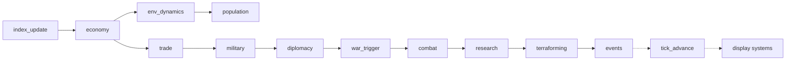
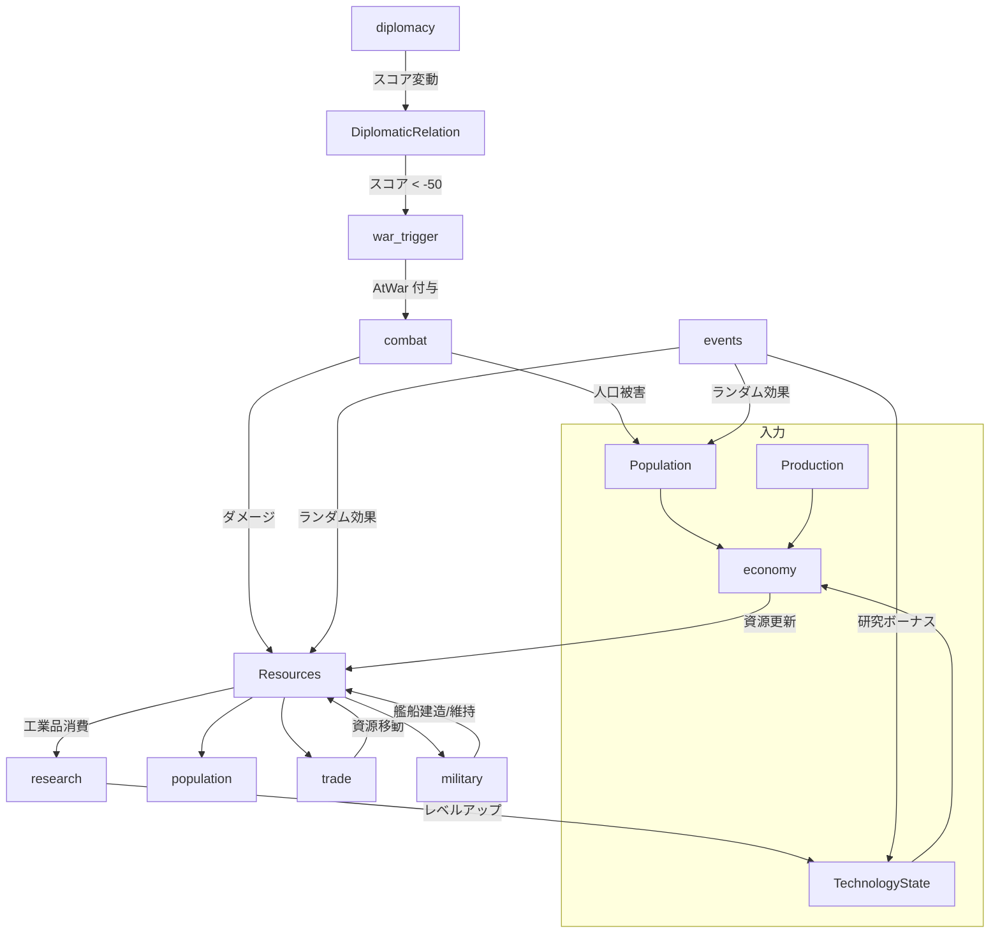

# アーキテクチャ設計書

## 概要

Deep Juno は **Bevy ECS** をヘッドレスモードで使用した Tick ベースの文明シミュレーションエンジンである。
グラフィクスを排除し、`MinimalPlugins` + `ScheduleRunnerPlugin` で高速な離散時間ループを実現する。

---

## 設計原則

| 原則 | 詳細 |
|------|------|
| **ECS 駆動** | 全てのドメインロジックを Component + System で表現。密結合を回避 |
| **決定論的再現** | 乱数は使わず `seed × tick × index` のハッシュで決定論を保証 |
| **Tick ベース** | 連続時間ではなく離散 Tick で進行。`FixedUpdate` スケジュールを使用 |
| **プラグイン分離** | 初期化 / シミュレーション / 出力を独立プラグインに分離 |
| **ドメインと表示の分離** | `SimulationEvent` (Bevy Event) でドメインロジックと表示エンジン（CLI/TUI）を完全分離 |

---

## レイヤー構成

```
┌──────────────────────────────────────────────────┐
│                    main.rs                       │
│  CLI 引数パース → App::new() → Bevy 起動         │
├──────────────────────────────────────────────────┤
│                  Plugins Layer                   │
│  ┌──────────┐ ┌──────────────┐ ┌──────────────┐ ┌─────────────┐  │
│  │WorldInit │ │ Simulation   │ │  CliOutput   │ │  TuiOutput  │  │
│  │ Plugin   │ │   Plugin     │ │   Plugin     │ │   Plugin    │  │
│  └──────────┘ └──────────────┘ └──────────────┘ └─────────────┘  │
├──────────────────────────────────────────────────┤
│  Domain Systems         SimulationEvent           │
│  index_update → economy → env_dynamics →         │
│  population → trade → military → diplomacy →     │
│  war_trigger → combat → research →               │
│  terraforming → events                           │
│                           │                        │
│                           ▼                        │
│  Display Systems    [EventReader]                  │
│  (cli_event_display | tui_event_collector) →       │
│  (cli_summary       | tui_render)                  │
├──────────────────────────────────────────────────┤
│                Components Layer                  │
│  Resources, Production, Population,              │
│  MilitaryStrength, DiplomaticRelation, AtWar,    │
│  TechnologyState, TradeRoute, EventLog,          │
│  SimulationEvent, EventEffect                    │
├──────────────────────────────────────────────────┤
│                 Bevy ECS Runtime                 │
│  MinimalPlugins + ScheduleRunnerPlugin           │
└──────────────────────────────────────────────────┘
```

---

## ディレクトリ構成

```
src/
├── main.rs              # エントリーポイント・CLI・App セットアップ
├── config.rs            # SimulationConfig リソース
├── tick.rs              # CurrentTick リソース・TickPlugin
│
├── components/          # ── データ定義 ──
│   ├── mod.rs
│   ├── common.rs        # Name, Planet, Nation, StarSystem, BelongsTo*
│   ├── economy.rs       # Resources, Production, TradeRoute, DepletableResources
│   ├── environment.rs   # PlanetaryEnvironment, RenewableResources, EnvironmentalHealth
│   ├── population.rs    # Population
│   ├── military.rs      # MilitaryStrength
│   ├── diplomacy.rs     # DiplomaticRelation, AtWar
│   ├── national_ai.rs   # NationalCharacter, NationalIdentity, NationalMemory, InternalFactions
│   ├── technology.rs    # TechnologyState, TechField
│   ├── terraforming.rs  # TerraformingProject, TerraformingPhase
│   ├── events.rs        # EventKind, EventEffect, EventLog
│   ├── nation_index.rs  # NationPlanetIndex
│   └── simulation_event.rs  # SimulationEvent (Bevy Event)
│
├── systems/             # ── ドメインロジック（表示ロジック含まず） ──
│   ├── mod.rs
│   ├── index_update.rs  # nation_index_update_system
│   ├── economy.rs       # resource_production_system, environment_dynamics_system
│   ├── population.rs    # population_growth_system
│   ├── trade.rs         # trade_system
│   ├── military.rs      # military_system
│   ├── diplomacy.rs     # diplomacy_system
│   ├── war.rs           # war_trigger_system, combat_resolution_system
│   ├── research.rs      # research_system
│   ├── terraforming.rs  # terraforming_system
│   └── events.rs        # event_system
│
└── plugins/             # ── 統合・初期化・表示 ──
    ├── mod.rs
    ├── world_init.rs    # 初期世界生成（3星系・惑星・国家・貿易・外交）
    ├── simulation.rs    # 全 System の FixedUpdate 登録と実行順序定義
    ├── cli_output.rs    # CLI 表示レイヤー（ログ・サマリーテーブル）
    ├── tui_output.rs    # TUI 表示レイヤー（ダッシュボード・入力処理）
    └── tui_state.rs     # TUI 用状態管理・制御リソース
```

---

## システム実行順序

`SimulationPlugin` が `FixedUpdate` スケジュールで以下の依存チェーンを定義する:



各ステップは明示的に `.after()` で依存関係を宣言しており、  
Bevy のスケジューラが並列実行可能な部分を自動検出する。

ドメインシステム（economy 〜 events）は `EventWriter<SimulationEvent>` で構造化データを送出し、  
表示システム（cli_event_display / cli_summary）が `EventReader<SimulationEvent>` で受信・描画する。  
ドメインシステムには `info!()` / `println!()` / 日本語メッセージ文字列は一切含まれない。

---

## データフロー



---

## エンティティ関係図

```mermaid
erDiagram
    StarSystem ||--o{ Planet : "BelongsToStarSystem"
    Planet ||--|| Population : has
    Planet ||--|| Resources : has
    Planet ||--|| Production : has
    Planet ||--|| MilitaryStrength : has
    Planet ||--|| PlanetaryEnvironment : has
    Planet ||--|| DepletableResources : has
    Planet ||--|| EnvironmentalHealth : has
    Planet ||--|| TerraformingProject : has
    Nation }o--|| Planet : "BelongsToPlanet"
    Nation ||--|| TechnologyState : has
    Nation ||--|| NationalCharacter : has
    Nation ||--|| NationalMemory : has
    Nation ||--|| InternalFactions : has
    DiplomaticRelation }o--|| Nation : "owner_nation"
    DiplomaticRelation }o--|| Nation : "target_nation"
    TradeRoute }o--|| Planet : "from_planet"
    TradeRoute }o--|| Planet : "to_planet"
    AtWar }o--|| Nation : "enemy_nation"
    AtWar }o--|| Planet : "own/enemy_planet"

> 詳細なクラス図と説明については [entity_relationships.md](architecture/entity_relationships.md) を参照してください。

## 懸念事項と設計課題

現在のアーキテクチャにおける懸念点や将来的な課題については [design_concerns.md](architecture/design_concerns.md) にまとめています。

```

---

## 決定論性の保証

1. **乱数不使用**: `rand` クレートは使わず、全ての「ランダム」要素を `seed × tick × index` の FNV 風ハッシュで生成
2. **固定 Tick**: `ScheduleRunnerPlugin::run_loop(Duration::from_millis(0))` で実時間非依存
3. **System 順序固定**: `.after()` チェーンで実行順序を完全に決定
4. **浮動小数点**: IEEE 754 準拠の演算のみ。同一プラットフォームでは完全再現
