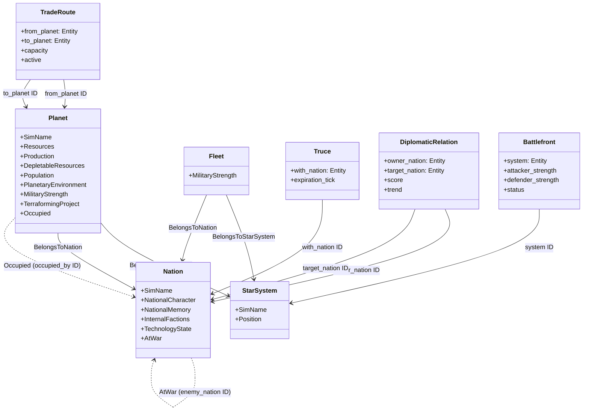

# エンティティ関連図 (Entity Relationships)

## 概要

本プロジェクトにおける主要なエンティティとそのコンポーネント、およびエンティティ間の関係性を示します。
Bevy ECS アーキテクチャを採用しており、データ（コンポーネント）とロジック（システム）が分離されていますが、概念的なモデルとしての関係性を理解するために以下のクラス図が役立ちます。

## クラス図 (Mermaid)

## 関係性の詳細

### 所有関係 (Ownership & Location)
*   **Planet (惑星)**:
    *   `BelongsToNation`: 特定の国家 (`Nation`) に所属します。
    *   `BelongsToStarSystem`: 特定の星系 (`StarSystem`) に配置されます。
*   **Fleet (艦隊)**:
    *   `BelongsToNation`: 特定の国家によって保有されます。
    *   `BelongsToStarSystem`: 宇宙空間（星系内）に存在します。

### 外交関係 (Diplomacy)
*   **DiplomaticRelation**:
    *   国家間の関係性を表す独立したエンティティです。
    *   `owner_nation` (主体) から `target_nation` (対象) への一方通行の関係性を保持します。双方向の関係性は、逆向きの `DiplomaticRelation` エンティティによって表現されます。
    *   ※宣戦布告などの重大なイベント時には、システムによって双方のスコアが同期的に更新されます。
*   **AtWar**:
    *   `Nation` エンティティに直接付与されるコンポーネントです。
    *   現在交戦中の相手国 (`enemy_nation`) や、戦争開始時刻、累積損害などを保持します。
*   **Truce**:
    *   `Nation` エンティティに付与されるコンポーネントです。
    *   指定された Tick まで、対象国への宣戦布告を禁止します。

### 経済・物流 (Economy & Logistics)
*   **TradeRoute**:
    *   2つの惑星 (`from_planet`, `to_planet`) を結ぶ貿易路を表す独立したエンティティです。
    *   輸送容量 (`capacity`) や活性状態 (`active`) を管理します。

### 戦争 (Warfare)
*   **Battlefront**:
    *   星系 (`StarSystem`) ごとに発生する戦闘状態を管理する独立したエンティティです。
    *   攻撃側・防衛側の戦力評価値や、現在の戦況ステータス (`Active`, `Resolved`) を保持します。
*   **Occupied**:
    *   占領された `Planet` に付与されるコンポーネントです。
    *   実効支配している国家 (`occupied_by`) と、もともとの所有国 (`original_owner`) の情報を保持します。
